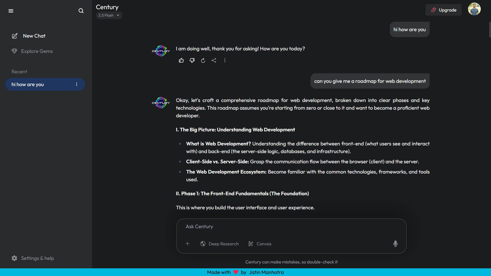
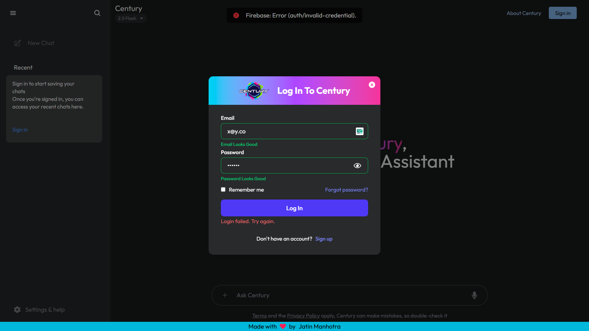

# 🤖 Century - Your Personal AI

A responsive AI chat app built with **React**, **Firebase**, and the **Gemini API**, enabling users to interact with an **AI assistant** in real-time. Features include chat history with rename/delete options, **authentication via Firebase**, dark mode with per-user preferences, and persistent storage of conversations. The app supports deep linking to specific chats, real-time UI updates, and client-side routing with React Router.

---

## 🚀 Live Demo

👉 Try it out - [Century AI](https://jatinmanhotra.github.io/react-century)

---

## 📸 Screenshots

### 💬 Chat Interface  


### 🔐 Authentication  


---

## 🔧 Tech Stack

- **React.js** - Frontend UI framework
- **React Router DOM** - Client-side routing
- **Tailwind CSS** - Styling with dark/light mode support
- **React Icons** - Icon set
- **UUID** - Generating unique chat IDs
- **Firebase Firestore** - Realtime NoSQL DB for storing conversations
- **Firebase Auth** - User authentication
- **Gemini API (via Google AI)** - AI text generation (Flash 2.0 model)

---

## 🧩 Features

### 🌟 Core Features
- 🔐 Firebase Authentication with Email & Password ( `Login and Signup` ).
- 🧠 AI responses using Gemini Flash 2.0.
- 📝 Persistent chat history (stored per user in `Firestore`).
- ✏️ Rename chats with modal input.
- ❌ Delete specific chats.
- 📑 Auto-save and restore chat history.
- 🔁 Dark/light mode toggling with `Firestore`.
- 🧭 Smooth routing between chat sessions.
- 📱 Fully responsive design.

### 🎯 UX Enhancements
- 🚀 Prompt navigation on new chat creation.
- ⏳ Loading indicator during AI response generation.
- 💬 Scrollable, adaptive message bubbles.

---

## 🧠 Gemini AI Chat Integration

- Model: **Gemini 2.0 Flash**.
- Uses structured `generateContent()` method for generating responses.
- App shows only valid, complete messages (no blank placeholders).
- Chat resets on new conversation.

---

## 🧹 Firebase Data Structure

```json
"users": {
  "uid": {
    "name": "User Name",
    "email": "user@example.com",
    "dark": true,
    "conversations": [
      {
        "id": "uuid-123",
        "title": "first few words of prompt",
        "createdAt": "Timestamp",
        "messages": [
          { "role": "user", "text": "Hello" },
          { "role": "ai", "text": "Hi there!" },
          "..."
        ]
      }
    ]
  }
}
```

---

### 🌱 Future Enhancements

- 📤 Upload files and send them to AI.
- 🧾 Export chat feature (as PDF or .txt).
- 📤 Share chat via dynamic link or social platforms.
- 🔊 Voice input/output support.
- 🧰 Backend for Gemini API proxy (to hide `API key`).
- 📱 Progressive Web App (PWA) for installable experience.
- 🗃️ Pagination or search in chat history.

---

## 📬 Contact

If you'd like to connect or provide feedback:

- 🌐 [Portfolio](https://jatinmanhotra.github.io/portfolio-2025)
- 📧 Email: jatinmanhotra31@gmail.com
- 💬 WhatsApp: [Chat here](https://wa.me/918493912066?text=Hi%20Jatin%2C%20I%20saw%20your%20Century%20App!)
- 💼 [LinkedIn](https://www.linkedin.com/in/jatin-manhotra-5b474a347/)
- 📷 [Instagram](https://www.instagram.com/manhotra.31/)
- 💻 [GitHub](https://github.com/JatinManhotra)
